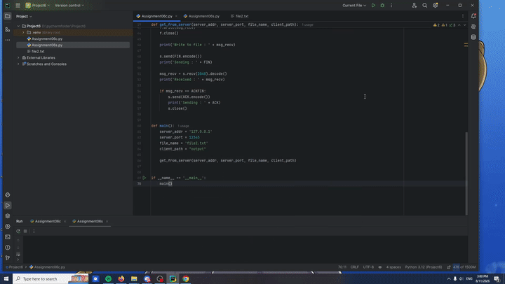
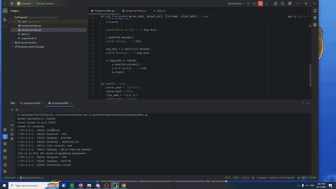

# Socket-Programming-With-Multithreading


## Assignment — Socket Programming 2 With Multithreading

**Author:** Kaiwen Liu
**Course:** CSCI 355 — Internet Web Technology
**Date:** July 2025

## 📌 Project Description

This project implements a **client-server file transfer system using Python sockets and multithreading**.

The client connects to the server using a custom **3-way handshake**, requests a file from the server, receives the file contents, and saves the file locally. The server is designed to handle multiple client connections using separate threads.

The project also implements a custom connection-closing handshake and a timeout mechanism for resending file contents.

## 🛠️ Technologies Used

* **Python**
* **Socket Programming**
* **TCP/IP**
* **Multithreading**
* **File I/O**
* **Client-Server Architecture**

## 📂 Project Structure

```text
Project6/
│
├── Assignment06c.py      # Client
├── Assignment06s.py      # Server
├── file2.txt             # File stored on the server
└── output/               # Directory for downloaded files
```

## 🔄 Communication Protocol

The client and server communicate using the following custom messages:

| Message          | Purpose                                 |
| ---------------- | --------------------------------------- |
| `SYN`            | Client initiates the connection         |
| `ACK+SYN`        | Server acknowledges the connection      |
| `ACK + filename` | Client requests a specific file         |
| File contents    | Server sends the requested file         |
| `FIN`            | Client requests to close the connection |
| `ACK+FIN`        | Server acknowledges the closing request |
| `ACK`            | Client confirms the closing handshake   |

### Connection Handshake

```text
Client                         Server
  |                              |
  | -------- SYN --------------> |
  |                              |
  | <------ ACK+SYN ------------ |
  |                              |
```

### File Request

```text
Client                         Server
  |                              |
  | ---- ACK + file_name ------> |
  |                              |
  | <------ File Contents ------- |
  |                              |
```

### Connection Closing

```text
Client                         Server
  |                              |
  | -------- FIN --------------> |
  |                              |
  | <------ ACK+FIN ------------ |
  |                              |
  | -------- ACK --------------> |
  |                              |
```

## 🧵 Multithreading

The server creates a separate thread for each connected client.

```python
threading.Thread(
    target=each_connection,
    args=(c, addr,)
).start()
```

This allows the server to handle multiple clients without requiring each client to wait for the previous connection to finish.

## ⏱️ File Resending

The server includes a timeout mechanism that can resend the file if an acknowledgment is not received within the specified timeout period.

The default timeout is:

```python
timeout = 10
```

This functionality is implemented using a separate thread so that the server can continue handling other operations.

## ▶️ How to Run

### 1. Start the Server

Run:

```bash
python Assignment06s.py
```

The server should display:

```text
Socket successfully created
socket binded to port 12345
socket is listening
```

### 2. Start the Client

In a separate terminal, run:

```bash
python Assignment06c.py
```

The client connects to the server using:

```python
server_addr = '127.0.0.1'
server_port = 12345
```

### 3. File Transfer

The client requests:

```text
file2.txt
```

The server reads the file and sends its contents to the client.

The downloaded file is saved in the client's output directory.

## 🖥️ Example Output

### Server

```text
Socket successfully created
socket binded to port 12345
socket is listening
('127.0.0.1', 52858) Connected
('127.0.0.1', 52858) Received : SYN
('127.0.0.1', 52858) Sending : ACK+SYN
('127.0.0.1', 52858) Received : ACKfile2.txt
('127.0.0.1', 52858) File contents read
('127.0.0.1', 52858) Sending : Hello from the server!
This is my CSCI 355 socket programming assignment.
('127.0.0.1', 52858) Received : FIN
('127.0.0.1', 52858) Sending : ACK+FIN
('127.0.0.1', 52858) Connection closed
```

### Client

```text
Connected
Sending : SYN
Received : ACK+SYN
Sending : ACKfile2.txt
Received : Hello from the server!
This is my CSCI 355 socket programming assignment.
Write to file : Hello from the server!
This is my CSCI 355 socket programming assignment.
Sending : FIN
Received : ACK+FIN
Sending : ACK
```

## 🎯 Learning Objectives

This project demonstrates:

* Creating TCP socket connections in Python
* Implementing a custom communication protocol
* Understanding client-server architecture
* Implementing connection handshakes
* Transferring files between a client and server
* Using Python threads to support multiple clients
* Implementing timeout and retransmission behavior
* Reading and writing files using Python

## 👤 Author

**Kaiwen Liu**
CSCI 355 — Internet Web Technology

🎥 Demo

The following GIF demonstrates the client-server communication, including the connection handshake, file request, file transfer, and connection closing process.






